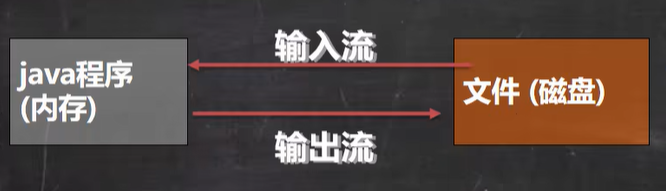

# Java基础--IO流

## 1、文件

* 什么是文件

  文件就是**保存数据的地方**，比如经常使用的word文档、txt文件、excel文件...都是文件。它既可以保存一张图片，也可以是视频、音频。

* 文件流

  文件在程序中是以流的形式来操作的

  

​		流：数据在数据源（文件）和程序（内存）之间经历的路径

​		输入流：数据从数据源（文件）到程序（内存）的路径

​		输出流：数据从程序（内存）到数据源（文件）的路径

## 2、常用的文件操作

* 创建文件对象相关构造器和方法

  * 常用方法

  ```java
  //根据路径构建一个File对象
  new File(String pathname)
  //根据父目录文件+子路径构建
  new File(File parent,String child)
  //根据父目录+子路径构建
  new File(String parent,String child)
  ```

  * 应用案例演示 FileCreate.java

  ```java
  /**
   * 请在d盘下，创建文件 news1.txt、news2.txt、news3.txt，用三种不同的方式创建
   * @author: yujh
   * @date: 2022/8/5 14:35
   * @version: 1.0
   */
  public class FileCreate {
  
      public static void main(String[] args) {
          boolean a,b,c;
          a=createFile1("d:\\news1.txt");
          b=createFile2("d:\\","news2.txt");
          c=createFile3("d:\\","news3.txt");
          System.out.println(a+"\t"+b+"\t"+c);
      }
      //方式一 new File(String pathname)
      public static boolean createFile1(String pathname){
          boolean b = false;
          File file1 = new File(pathname);
          try {b = file1.createNewFile();} 
          catch (IOException e) {e.printStackTrace();}
          return b;
      }
  
      //方式二 new File(File parent,String child)
      public static boolean createFile2(String parent,String child){
          boolean b = false;
          File file2_1 = new File(parent);
          File file2 = new File(file2_1,child);
          try {b = file2.createNewFile();} 
          catch (IOException e) {e.printStackTrace();}
          return b;
      }
  
      //方式三 new File(String parent,String child)
      public static boolean createFile3(String parent,String child){
          boolean b = false;
          File file1 = new File(parent,child);
          try {b = file1.createNewFile();} 
          catch (IOException e) {e.printStackTrace();}
          return b;
      }
  }
  ```

* 获取文件的相关信息

  * 常用方法

  ```java
  getName//名字
  getAbsolutePath//绝对路径
  getParent//父级目录
  length//文件里有多少字节
  exists//是否存在
  isFile//是否是文件
  isDirectory//是否是文件夹
  ```

  * 应用案例演示 FileInfomation.java

  ```java
  /**
   * 如何获取到文件的大小、文件名、路径、父File、是文件还是目录（目录本质也是文件，一种特殊的文件），是否存在
   * @author: yujh
   * @date: 2022/8/5 15:11
   * @version: 1.0
   */
  public class FileInfomation {
      public static void main(String[] args) {
  
      }
  
      @Test
      //获取文件的信息
      public void info(){
          //先创建文件对象
          File file = new File("d:\\news1.txt");
  
          //调用相应的方法，得到对应信息
          System.out.println("文件大小="+file.length());
          System.out.println("文件名字="+file.getName());
          System.out.println("文件绝对路径="+file.getAbsolutePath());
          System.out.println("文件父File="+file.getParent());
          System.out.println("是不是文件="+file.isFile());
          System.out.println("是不是目录="+file.isDirectory());
          System.out.println("是否存在="+file.exists());
  
      }
  }
  ```

* 目录的操作和文件删除

  * 常用方法

  ```java
  mkdir()//创建一级目录
  mkdirs()//创建多级目录
  delete()//删除空目录或文件
  ```

  * 应用案例演示 Directory_.java

  ```java
  /**
   * @author: yujh
   * @date: 2022/8/5 15:26
   * @version: 1.0
   */
  public class Directory_ {
      public static void main(String[] args) {
          File file = new File("D:\\demo");
          delete2(file);
      }
  
      //判断d:\\news1.txt是否存在，如果存在就删除
      @Test
      public void delete1() {
          File file = new File("d:\\news1.txt");
          if (file.exists()) {
              if (file.delete()) {
                  System.out.println("删除成功");
              } else {
                  System.out.println("删除失败");
              }
          } else {
              System.out.println("不存在");
          }
      }
  
      //判断D:\\demo2是否存在，存在就删除，否则提示不存在
      @Test
      public static void delete2(File file) {
          File[] files;
          File[] files1;
          while (file.exists()) {
              files = file.listFiles();
              if (files.length == 0) {
                  file.delete();
                  System.out.println("删除文件夹" + file.getAbsolutePath());
              } else {
                  for (int i = 0; i < files.length; i++) {
                      if (!files[i].isFile()) {
                          files1 = files[i].listFiles();
  //                        System.out.println(files1.length);
                          if (files1.length != 0) {
  
                              delete2(files[i]);
                          } else {
                              files[i].delete();
                              System.out.println("删除文件夹" + files[i].getAbsolutePath());
                          }
  
                      } else {
                          files[i].delete();
                          System.out.println("删除文件" + files[i].getAbsolutePath());
  
                      }
                  }
              }
          }
      }
  }
  ```

## IO流原理及流的分类

* Java IO流原理

  1、I/O是Input/Output的缩写，I/O技术是非常实用的技术，用于处理数据传输。如读/写文件，网络通讯等。

  2、Java程序中，对于数据的输入/输出操作以“流（stream）”的方式进行。

  3、java.io包下提供了各种“流”类和接口，用以获取不同种类的数据，并头盖骨方法输入或输出数据。

  4、输入input：读取外部数据（磁盘、光盘等存储设备的数据）到程序（内存）中。

  5、输出output：将程序（内存）数据输出到磁盘、光盘等存储设备中。

* 流的分类

  * 按操作数据单位不同分为：字节流（8 bit）二进制文件，字符流（按字符）文本文件
  * 按数据流的流向不同分为：输入流，输出流
  * 按流的角色的不同分为：节点流，处理流/包装流

  | （抽象基类） |    字节流    | 字符流 |
  | :----------: | :----------: | :----: |
  |    输入流    | InputStream  | Reader |
  |    输出流    | OutputStream | Writer |

  Java的IO流共涉及40多个类，实际上非常规则，都是从如上4个抽象基类派生的。

  由这四个类派生出来的子类名称都是以其父类名作为子类名后缀。